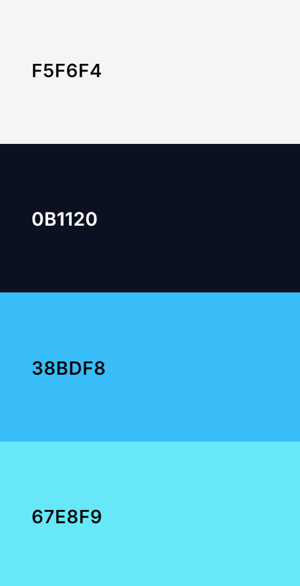
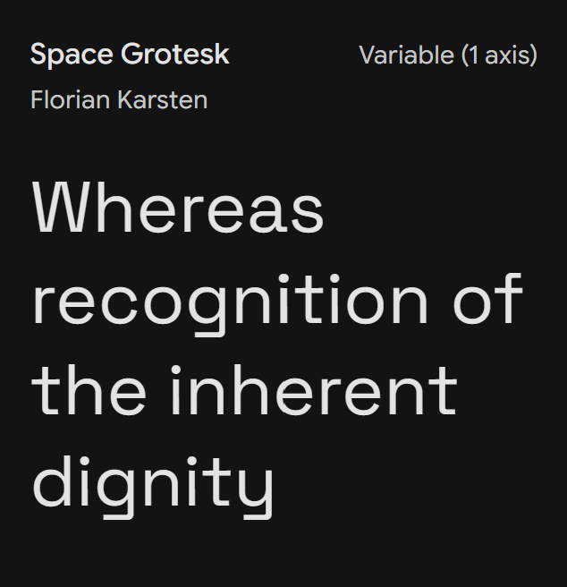
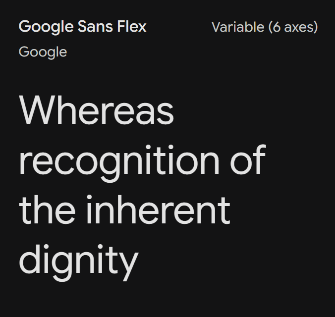
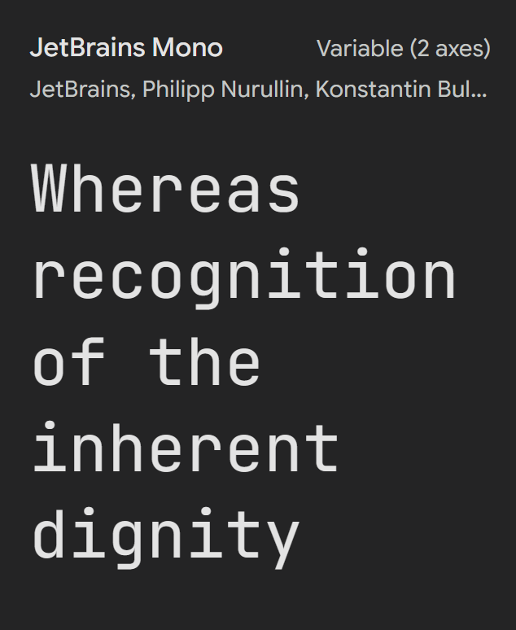

# Project Title

Brief overview of the project.

The project can be viewed [here](https:// PROJECT URL).

Interact with the site on different screen sizes [here](https://fireship.dev/amiresponsive?url= PROJECT URL)

## UX

### Strategy

#### Purpose

#### Primary User Needs

#### Business Goals

### Scope

#### Content Requirements

##### User Stories

| User Story | Feature | Acceptance Criteria |
| --- | --- | --- | --- |

See **[Features](#features)** below.

#### Agile Approach

Defining the MVP. Project Board & MoSCoW prioritisation here. MVP first development.

### Structure

#### Information Architecture

##### Navigation

##### Hierarchy

#### User Flow

### Skeleton

#### Wireframes

### Surface

#### Colour

#### Typography

##### Display Font

Discussion of reasoning for choice.

#### Body Font

Discussion of reasoning for choice.

#### Utility Font

Discussion of reasoning for choice.

#### Shape & Space

#### Animation & MicroInteractions

## Features

| Feature | Image | User Value |
| --- | --- | --- | --- |

## Tools & Technologies

### Core

- HTML
- CSS
- JavaScript

### Frameworks & Libraries

- Bootstrap 5.3.x ************************ REMOVE IF NO
- *************8 ICONS

### Version Control & Deployment

- Git
- GitHub
- GitHub Pages

### AI Contributions

A comment on how AI use impacted on workflow

#### Written contributions

#### Design Contributions

#### Code Contributions

Note the usage of AI & reasoning for this usage.

#### Debugging Contributions

Note key interventions

### Additional Technologies

- Bash Scripting *************8 REMOVE IF NA

## Testing

### Manual Testing
#### User Story Acceptance Criteria

| User Story | Acceptance Criteria | Testing
| --- | --- | --- | --- |
Either Pass or a link to the Issue created as a result of the failure.

#### Development vs Deployed
There are no major discrepancies between the development version of the site, and the deployed version.

### Code Validation

#### HTML

#### CSS

#### JavaScript

### Lighthouse

### Known Bugs
If any, explain why they have not yet been resolved.

## Deployment

### GitHub Pages

### Local Development

#### Cloning

## Attribution

### Code

See [AI Tools - Code Contributions](#code-contributions)

### Media

## Future Features
