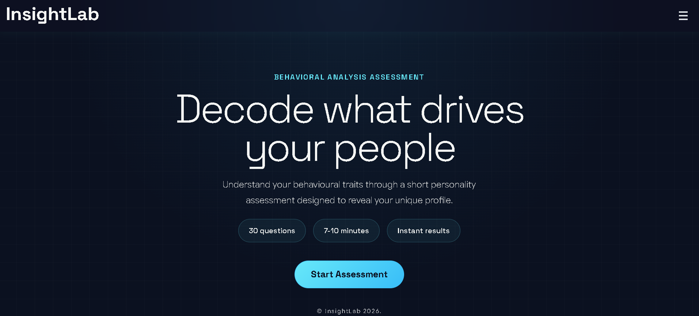
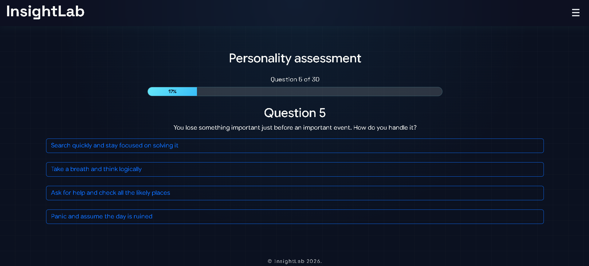
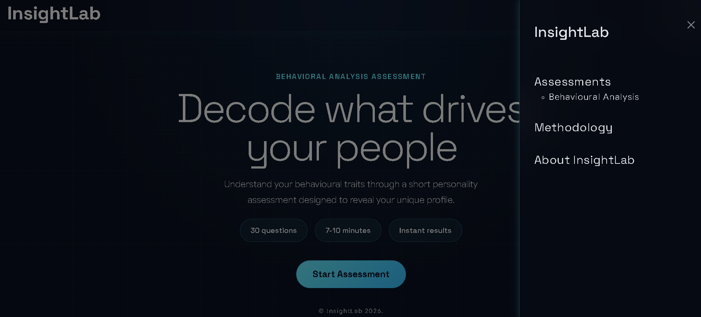
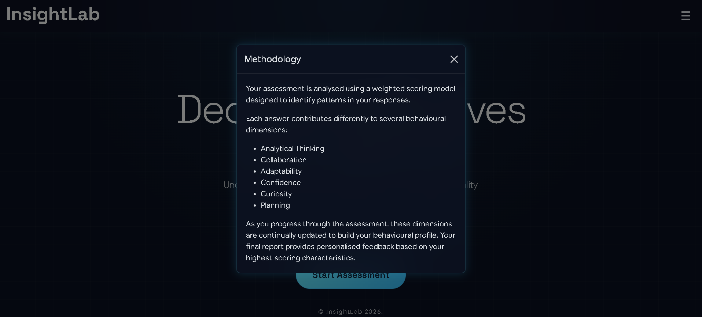
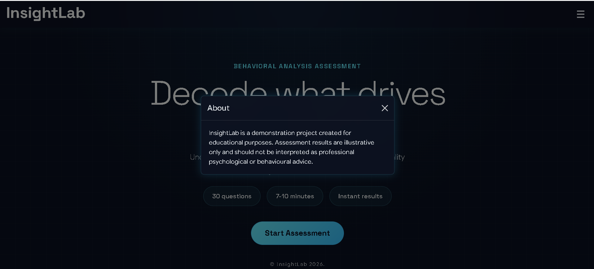
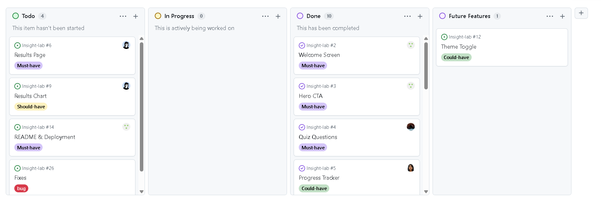
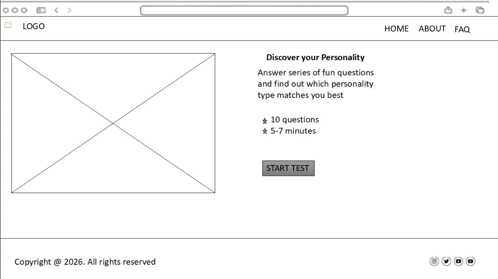
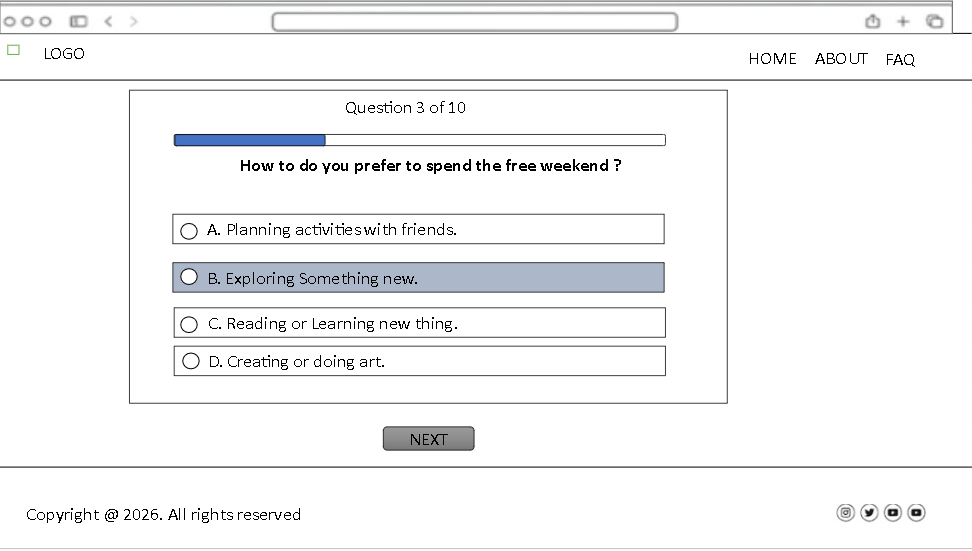
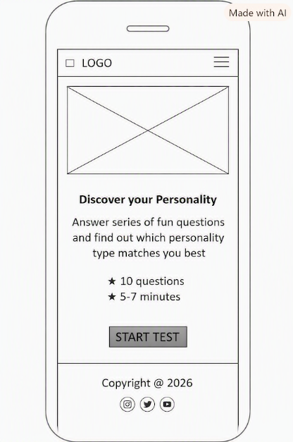
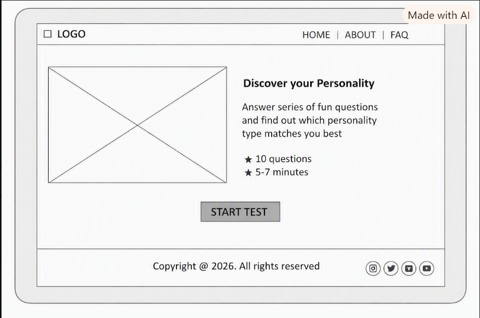

# Insight Lab

InsightLab is an interactive behavioural analysis web application developed as part of a collaborative JavaScript hackathon. Users complete a series of scenario-based multiple-choice questions before receiving a personalised behavioural profile based on their responses. The application combines a modern, responsive interface with dynamic JavaScript functionality to deliver an engaging and accessible assessment experience.

[View the deployed project](https://qasim5259.github.io/insight-lab).

[Interact with the site on different screen sizes](https://fireship.dev/amiresponsive?url=https://qasim5259.github.io/insight-lab).

## UX

### Strategy

#### Purpose

InsightLab was designed to provide users with an engaging and accessible behavioural assessment experience. Through a series of scenario-based questions, users gain insight into their behavioural tendencies while interacting with a clean, modern interface that keeps the focus on the assessment itself.

#### Primary User Needs

- Complete a behavioural assessment quickly and easily.
- Receive clear, personalised results.
- Navigate the assessment without confusion.
- Access the application across desktop, tablet and mobile devices.
- Enjoy a responsive and visually engaging experience.

#### Business Goals

- Provide an intuitive behavioural assessment platform.
- Demonstrate modern front-end development techniques.
- Encourage users to complete the full assessment.
- Present behavioural results in a clear, meaningful and easy-to-understand format.
- Create a professional interface that inspires confidence and trust.

### Scope

#### Content Requirements

The application contains 30 scenario-based multiple-choice questions that assess different behavioural dimensions. Each response contributes to the user's behavioural profile, with results calculated dynamically using JavaScript. The assessment presents a randomly selected set of questions to improve replayability while providing users with immediate feedback upon completion.

#### User Stories

#### User Story 1

As a user visiting the site for the first time, I want to see a clear introduction to the personality assessment so that I understand what the quiz is about before I begin.

##### Feature:

Welcome screen

##### Acceptance Criteria:

- Landing page includes a clear heading and introduction.
- The purpose of the personality assessment is explained.
- The layout is responsive across mobile, tablet and desktop.
- The page loads correctly without errors.

#### User Story 2

As a user eager to begin the assessment, I want a clear "Start Assessment" button so that I can begin the quiz immediately.

##### Feature:

Hero CTA

##### Acceptance Criteria:

- A prominent Start Assessment button is displayed.
- Button navigates the user to the quiz.
- Button is clearly visible on all screen sizes.
- Hover and focus states are implemented.

#### User Story 3

As a user, I want to answer multiple-choice questions so that my personality can be analysed accurately.

##### Feature:

Quiz Questions

##### Acceptance Criteria:

- Questions display correctly.
- Four answer options are available for each question.
- Only one answer can be selected per question.
- Answers are recorded correctly.

#### User Story 4

As a user, I want to know how far through the quiz I am so that I understand my progress.

##### Feature:

Progress Tracker

##### Acceptance Criteria:

- Progress updates after each answered question.
- The current question number is displayed.
- The progress bar reaches 100% on the final question.
- The progress bar is hidden on the results page.

#### User Story 5

As a user, I want to retake the assessment so that I can explore how different answers affect my result.

##### Feature:

Retake Quiz button

##### Acceptance Criteria:

- A Retake Quiz button is displayed.
- Previous answers are cleared.
- Quiz restarts from Question 1.
- New results are calculated correctly.

#### User Story 6

As a mobile, tablet and desktop user, I want the website to adapt to my screen size so that I can complete the assessment comfortably.

##### Feature:

Responsive Design

##### Acceptance Criteria:

- Layout works from approximately 320px upwards.
- Navigation remains usable.
- No overlapping content.
- Images scale correctly.

#### User Story 7

As a first-time visitor, I want simple navigation so that I can easily move around the website.

##### Feature:

Navigation menu

##### Acceptance Criteria:

- Navigation links work correctly.
- Active links are visible.
- Navigation is responsive.
- Users can easily return to the homepage.

#### User Story 8

As a curious user, I want to receive my personality result once I complete the quiz so that I can learn more about myself.

##### Feature:

Results page

##### Acceptance Criteria:

- A personality result is displayed.
- Result matches the user's answers.
- Description explains the personality type.
- Results page is responsive.

#### User Story 9

As a user with accessibility needs, I want the website to be easy to use so that I can complete the assessment without barriers.

##### Feature:

Accessibility

##### Acceptance Criteria:

- Keyboard navigation works.
- Colour contrast meets accessibility guidelines.
- Images include alternative text.
- Appropriate ARIA labels are used where required.
- Reduced motion preferences are respected.

###### Features:

### Welcome Screen

The welcome screen introduces users to the InsightLab behavioural assessment. It explains the purpose of the quiz, what users can expect, and provides key information before starting the assessment.

### Hero Call-To-Action

The hero section includes a prominent "Start Assessment" button, allowing users to immediately begin the quiz and providing a clear first action for new visitors.

### Behavioural Assessment Questions

The assessment presents users with scenario-based multiple-choice questions designed to analyse behavioural traits. Users answer each question individually before progressing through the assessment.

### Progress Tracker

The progress tracker displays the user's current position within the assessment. It updates as questions are completed and helps users understand how far they are through the quiz.

### Responsive Navigation

The responsive navigation menu allows users to access different sections of the application, including the assessment, methodology explanation and information about InsightLab. The menu adapts to different screen sizes using an offcanvas layout.

### Methodology Explanation

The methodology modal explains how the behavioural assessment is calculated. It provides users with transparency about how their answers contribute to their final profile.

### About InsightLab

The About modal provides information about the purpose of the project and clarifies that InsightLab is an educational demonstration project.

### Results Page

After completing the assessment, users receive a behavioural profile generated from their answers. The results page presents the calculated traits and provides users with insight into their responses.

See **[Features](#features)** below.

### Agile Approach

InsightLab was developed using an Agile approach, allowing the team to collaborate effectively, prioritise features, and continuously improve the application throughout the development process.

The team used a GitHub Project board to manage tasks and track progress. User stories were created to represent the needs of different users, with acceptance criteria used to define when each feature was complete.

The MoSCoW prioritisation method was used to identify the most important features for the Minimum Viable Product (MVP):

- **Must Have:** Core assessment functionality, multiple-choice questions, progress tracking, results generation, responsive design and accessible navigation.
- **Should Have:** Additional information explaining the assessment methodology and improving user understanding.
- **Could Have:** Additional enhancements such as visual results representations and theme customisation.

Git and GitHub were used for version control, with each team member working on separate branches before submitting pull requests for review and merging into the main branch. This helped maintain code quality, reduce conflicts and support collaborative development.

### Structure

#### Information Architecture

InsightLab follows a simple single-page application structure, allowing users to complete the behavioural assessment without navigating between multiple pages. The interface is organised into clear sections that guide users from introduction, through the assessment, to their final results.

The application structure follows this user journey:

1. **Welcome Screen**
   - Introduces users to the behavioural assessment.
   - Explains what users can expect before starting.
   - Provides the primary call-to-action to begin the assessment.

2. **Assessment Screen**
   - Displays scenario-based multiple-choice questions.
   - Provides progress tracking to show completion status.
   - Allows users to answer questions one at a time.

3. **Results Screen**
   - Presents the user's calculated behavioural profile.
   - Displays results based on their selected responses.
   - Allows users to restart the assessment.

4. **Supporting Information**
   - Navigation menu provides access to additional information:
     - Assessment methodology.
     - About InsightLab.

##### Navigation

The navigation system was designed to remain simple and intuitive. A responsive offcanvas menu allows users to access supporting information while keeping the main assessment experience focused.

The navigation includes:

- Behavioural Assessment
- Methodology explanation
- About InsightLab

The InsightLab logo also allows users to return to the welcome screen during the assessment.

##### Hierarchy

The content hierarchy was designed to prioritise the user's main goal: completing the assessment.

The hierarchy follows:

1. Introduction and expectations
2. Start assessment call-to-action
3. Question completion and progress tracking
4. Personalised behavioural results
5. Additional supporting information

### Skeleton

#### Wireframes

**Desktop**

**Mobile**

**Tablet**

### Surface

InsightLab's visual identity was designed to reflect the values of a modern behavioural analysis platform: clarity, trust and precision. The aim of a creating a clean, focused, professional & accessible interface, was integral to the design choices in this project.

#### Colour

coolors link to colour palette: https://coolors.co/f5f6f4-0b1120-38bdf8-67e8f9

The colour scheme for InsightLabs provides a calm, focused & professional palette. The dark interface reduces visual clutter, keeps attention on the content, and creates a premium aesthetic associated with modern analytics software.

Gradations of these tones are used to allow the UI to have depth, without increasing visual complexity, brighter accent colours are used to provide balance and depth. The aqua accent creates the sense of technology and intelligence; which is well paired with the reliability and trust of the deep navy base.

Colour is used sparingly to communicate hierarchy and interaction rather than decoration, resulting in a professional, accessible experience.

#### Typography

##### Display Font

The display font, Space Grotesk, is a modern san-serif font. The angular, geometric quality of the font communicates precision, modernity & intelligence. These attributes are aligned with the brand personality of InsightLabs.

However, the technicality of the font is offset by the roundedness and openness of the letter-forms and generous spacing, particularly in the heavier font weights. Having this balance it particularly important for an assessment platform: the ; its dual appeal means it caters to both of the core users of the site.

The overall impact is an approachable, clean & organised interface.

#### Body Font

#### Utility Font

This monospaced, technical font is well suited to conveying the data-driven nature of the results page.

#### Shape & Space

#### Shape & Space

InsightLab uses a clean and minimal design approach, with carefully considered spacing and rounded components to create a modern and approachable interface.

Rounded corners are used throughout the application, including buttons, assessment cards, navigation elements and modal windows. This creates a softer visual style while maintaining a professional appearance.

Generous spacing between sections and interface elements helps reduce visual clutter and allows users to focus on completing the assessment. The layout uses consistent padding and alignment to create a clear visual hierarchy and improve readability across different screen sizes.

Interactive elements such as buttons and progress indicators use clear visual boundaries to help users understand available actions. The use of spacing and contrast ensures important elements, such as the Start Assessment button and quiz options, remain easy to identify.

The responsive design adapts the spacing and layout across desktop, tablet and mobile devices to maintain usability and a consistent user experience.

## Tools & Technologies

### Core

- HTML
- CSS
- JavaScript

### Frameworks & Libraries

- Bootstrap 5.3.x
- Google fonts
- Icons8 - used for the favicon icon.

### Version Control & Deployment

- Git
- GitHub
- GitHub Pages

### Design Tools

- Adobe Express: used to design favicon

### AI Contributions
Mohammed: 

Design Contributions:
Microsoft copilot was used to generate the sample questions for the quiz itself. The AI was prompted with the idea for the quiz and returned a range of 30 ideas with responses to the questions which were then amended for suitability purposes.

Debugging contributions: 
Copilot was used to amend certain visual glitches and inconsistencies. It also was used to explain certain concepts for me and walk me through how those concepts were applied to our project, such as the inserting impermanent components into the DOM and then ultimately into the index.html.

Code Contributions: 
Copilot was used to formulacome up with the random shuffle for the question pool and it used the fisher yates algorithm for that purpose. The AI also contributed code with regards to the results tallying and failsafing of the quiz element.
 

### AI Tools

- copilot
- OpenAI

#### Written contributions

- Chat GPT was used to brainstorm initial project ideas. These were expanded and developed by the developers during the ideation phase
- Chat GPT was used to generate question and answer sets to populate quiz data

#### Design Contributions

- Claude Chat was used to generate a range of colour schemes & typography pairings suitable to the concept. One of these was selected by the developers & developed to create the visual indentity of InsightLab

#### Code Contributions

- GitHub Copilot was used to generate a test suite for the results
- GitHub Copilot was useful in planning and executing code refactoring, to increase separation of concern between the quiz & results sections
- Chat GPT was used to create the CSS code for the background grid, radial glow & vignette effect
- Chat GPT was useful in creating code to improve the appearance of the AmCharts for the results section
- Chat GPT was used in implementing and refining the progress bar feature.

#### Debugging Contributions

- Chrome DevTools Gemini was useful in identifying and resolving Z-Index-related layout rendering bugs
- GitHub Copilot was useful in swiftly identifying & resolving rendering issues for the results charts caused by missing dependencies

### Additional Technologies

- Bash Scripting **\*\***\***\*\***8 REMOVE IF NA

## Testing

### Manual Testing

#### Development vs Deployed

There are no major discrepancies between the development version of the site, and the deployed version.

### Code Validation

#### HTML

#### CSS

#### JavaScript

### Lighthouse

### Known Bugs

## Deployment

### GitHub Pages

InsightLab was deployed using GitHub Pages. The deployed version is hosted directly from the project's GitHub repository.

To deploy the project:

1. Navigate to the repository on GitHub.
2. Open **Settings**.
3. Select **Pages** from the left-hand menu.
4. Under **Build and deployment**, select the deployment source:
   - Branch: `main`
   - Folder: `/root`
5. Save the settings.
6. GitHub Pages automatically builds and publishes the website.

The live application can be accessed here:

[View InsightLab](https://qasim5259.github.io/insight-lab)

### Local Development

To run InsightLab locally, follow these steps:

1. Clone the repository from GitHub.
2. Open the project folder in your code editor.
3. Launch the application using a local development server.

The project uses HTML, CSS and JavaScript modules, so running the application through a local server is recommended to ensure all functionality works correctly.

#### Cloning

To clone this repository:

1. Open your terminal.

2. Clone the repository:

bash
git clone https://github.com/qasim5259/insight-lab.git

3. Navigate into the project directory: cd insight-lab

4. Open the project in your preferred code editor.

5. Run the project using a local server, such as VS Code Live Server.

## Attribution

### Code

- The SVG noise effect was adapted from [CSS-Tricks: Grainy Gradients](https://css-tricks.com/grainy-gradients/).
- Bootstrap components and utilities were used from the official Bootstrap documentation.
- ChatGPT was used as a development assistant for debugging support, explaining concepts and improving documentation. Details are included in the AI Contributions section.

### Media

- Favicon icon created using Icons8. Attribution provided according to Icons8 licensing requirements.
- Fonts provided by Google Fonts:
  - Space Grotesk
  - Google Sans Flex
  - JetBrains Mono
- Noise texture effect adapted from CSS-Tricks.

## Future Features

- Allowing users to download or email their results.
- Adding user accounts so users can save previous assessments.
- Expanding the question database with additional scenarios.
- Adding a light/dark mode toggle.
- Improving result comparisons between multiple attempts.
